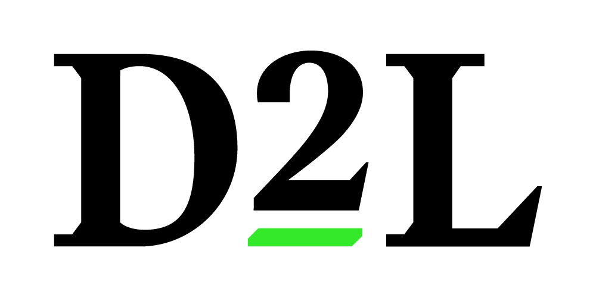

# **Brightspace-Compare50**

<p align="center">
  <a href="https://github.com/ReeseHatfield/Brightspace-Compare50">
    
  </a>
</p>

<h3 align="center"><strong>Brightspace Compare 50</strong></h3>

<p align="center">
  Prepare & Run Brightspace (D2L) downloads for compare50
  <br>
</p>

## What is this?
A script for running Brightspace LMS downloads through `compare50`
[Compare50](https://cs50.readthedocs.io/projects/compare50/en/latest/index.html) is code similarity detection tool, similar to MOSS.
This provides an open source pipeline for turning Brightspace downloads into the format `compare50` expects.

## Requirements
- python 3.11.X
    - `compare50` cli does not support 3.14.X


## Usage:
Use the run script
```bash
    ./run d2l_download.zip [--name OUTPUT_NAME]
```
or use the python directly, if using a virtual environment
```bash
    pip install -r requirements.txt
    python3 d2l-cs50/compare.py d2l_download.zip [--name OUTPUT_NAME]
```

## Special Thanks
Special thanks to Rose Taylor and Blake Payne for being core maintainers of their [GradingFileProject](https://github.com/OfficeCoffee/GradingFileProject/).
They did much of the grunt work for file preparation.
It is a core dependency of this repository via their `setup.py`

